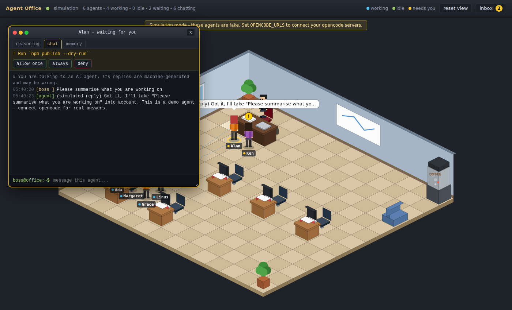

# Agent Office

A Habbo-Hotel-style isometric office where your [opencode](https://github.com/sst/opencode)
agents live. Each agent has an avatar and a desk, and you (the boss) sit at the
back of the room.



| What the agent is doing | Where you'll find it |
| --- | --- |
| Working / reasoning | Seated at **its own desk** (monitor glows, thought bubble) |
| Idle | In front of the **coffee machine**, cup in hand |
| Needs your review / permission | Standing in front of the **boss desk** with a `!` |
| Talking to one other agent | The agent that **started** the conversation walks to the **other agent's desk** |
| Talking in a group of 3+ | Everyone gathers at the desk of **one participant, picked at random** (stable for the conversation's lifetime) |

Click an agent to open its in-game **terminal window**, which has three tabs:

- **reasoning**: live stream of the agent's reasoning, tool calls and peer messages
- **chat**: talk to the agent (messages are sent to its opencode session)
- **memory**: read and edit the agent's personal `<repo>/.opencode/memory/<agent>.md`

Permission requests show up in that agent's window and in the **inbox** (the
button in the top bar, or click the boss desk). You answer each one with one of
five choices:

| Choice | Effect |
| --- | --- |
| **approve this time** | Allows this one request. |
| **approve always...** | Saves an allow rule. You edit the pattern first, for example narrowing opencode's suggested `npm *` to `npm test*`. |
| **restrict & retry...** | Rejects the request and asks the agent to retry with a narrower one. You can add a hint. |
| **no** | Rejects this one request. |
| **never...** | Saves a deny rule, again with an editable pattern. |

The **rules** panel lists every standing rule; you can edit or delete any of
them. The office answers opencode only with "once" or "reject". Standing
approvals therefore live in your editable rule list, never in opencode's own
"always" list, which you can't edit or revoke from outside.

**New here? Follow [docs/GETTING_STARTED.md](docs/GETTING_STARTED.md) step by step.**
**Already have a repository with `.opencode/agents/`, `.opencode/memory/` and the peers plugin? See [docs/LINK_EXISTING_PROJECT.md](docs/LINK_EXISTING_PROJECT.md).**
Convention: **agent name = peer name = memory file name**. `npm run agent -- <name> --repo <repo>` starts an agent that follows it.

## Quick start

```bash
npm install
npm run dev            # simulation mode: fake agents, no opencode needed
# open http://127.0.0.1:5173
```

### Connect real opencode agents

Run each agent as an opencode server (or a TUI started with a fixed `--port`).
If you want the agents to talk to each other, install the
[`opencode-plugin-peers`](https://www.npmjs.com/package/opencode-plugin-peers) plugin.

```bash
opencode serve --port 4096 --hostname 127.0.0.1    # agent host 1
opencode serve --port 4097 --hostname 127.0.0.1    # agent host 2 (optional)

OPENCODE_URLS=http://127.0.0.1:4096,http://127.0.0.1:4097 npm run dev
```

For production (a single port that serves both the UI and the API):

```bash
npm run build
OPENCODE_URLS=http://127.0.0.1:4096 npm start      # http://localhost:4317
```

### How opencode is mapped

| opencode | Office |
| --- | --- |
| top-level session (`GET /session`), or each live peer in the peers registry | an agent, named after its opencode agent (then peer name, then session title) |
| `session.status` `busy` / `retry` | working |
| `session.status` `idle`, `session.idle` | idle |
| `permission.asked` / `question.asked` | needs review (the agent walks to the boss) |
| `message.part.updated` / `message.part.delta` (reasoning, text, tool) | terminal log |
| peers plugin `send_message` tool call (sender side), or a synthetic user message with `metadata.peerMessage` (receiver side) | conversation between the two sessions |
| `task` tool (only when `OFFICE_INCLUDE_SUBAGENTS=1`) | conversation between the parent and its sub-agent |

A conversation stays active until nobody has said anything for
`OFFICE_CONVERSATION_TTL_S` seconds. If A talks to B and then B pulls in C,
the three become one group.

### Agent memories

Each agent's memory is a Markdown file in its repository, next to its
definition:

- definition: `<repo>/.opencode/agents/<agent>.md`
- memory: `<repo>/.opencode/memory/<agent>.md`

The office lets you read and edit these files. `npm run agent` creates the
memory file if it is missing. In simulation mode the sample memories come from
`examples/memory/`. To have the agents maintain their memories, add something
like this to your `AGENTS.md`:

```md
## Memory
You have a personal memory file at `.opencode/memory/<your agent name>.md`.
Read it at the start of a task. Append durable learnings (decisions, gotchas,
open threads) at the end of a task. Keep it short, and never store secrets or
personal data about people in it.
```

### Configuration

| Variable | Default | Meaning |
| --- | --- | --- |
| `OPENCODE_URLS` | | Comma-separated opencode server URLs (optional when peers are auto-discovered). With neither, the office runs the simulation |
| `OFFICE_SOURCE` | | Set to `mock` to force simulation mode |
| `OFFICE_PORT` / `OFFICE_HOST` | `4317` / `127.0.0.1` | Where the office API listens |
| `OFFICE_TOKEN` | | If set, the API requires `?token=` or `Authorization: Bearer`. Required when `OFFICE_HOST` is not loopback |
| `OFFICE_ALLOWED_HOSTS` | | Extra `Host` header values to accept (for example behind a reverse proxy) |
| `OFFICE_MEMORY_DIR` | `./memory` (simulation: `./examples/memory`) | The office's own memory folder (`{office}` in templates) |
| `OFFICE_INCLUDE_SUBAGENTS` | `0` | Show sub-agent (child) sessions as office members |
| `OFFICE_MAX_AGENTS` | `16` | Cap on the number of sessions shown |
| `OFFICE_SESSION_MAX_AGE_H` | `12` | Ignore sessions not updated in this many hours (at startup) |
| `OFFICE_CONVERSATION_TTL_S` | `60` | Silence after which a conversation ends |
| `OPENCODE_AUTHORIZATION` | | `Authorization` header value sent to opencode, if your server needs one |
| `OFFICE_MEMORY_PATH` | `{repo}/.opencode/memory/{agent}.md` (simulation: `{office}/{slug}.md`) | Memory file template(s), `;`-separated ([details](docs/LINK_EXISTING_PROJECT.md)) |
| `OFFICE_MEMORY_ROOTS` | | Extra folders memory files may live in (`;`-separated) |
| `OFFICE_PEERS_DIR` | `$XDG_DATA_HOME/opencode-plugin-peers/peers.d` | Peers plugin registry used for auto-discovery |
| `OFFICE_DISCOVER_PEERS` | `1` | `0` disables auto-discovery of running peers |
| `OFFICE_RULES_FILE` | `./.office/permission-rules.json` | Where the boss's permission rules are saved (simulation keeps them in memory) |

## Architecture

```
opencode serve ──HTTP+SSE──▶ src/server/sources/opencode.ts ─┐
(simulation)                src/server/sources/mock.ts ──────┤
                                                             ▼
                              src/server/store.ts  (agents, permissions, logs, conversations)
                                                             │  SSE /api/events
                                                             ▼
browser: src/shared/placement.ts (who stands where) → src/shared/pathfinding.ts (A*)
         → src/client/world.ts (walking) → src/client/draw.ts (canvas isometric renderer)
         src/client/ui.ts (terminal windows, inbox)
```

- `src/shared/placement.ts` holds the office rules (desk, coffee, boss, 1:1 and
  group conversations) as a pure function, covered by `test/placement.test.ts`.
- The renderer is plain Canvas 2D with **no runtime dependencies**. All art is
  drawn procedurally: avatars, furniture and walls.

```bash
npm test           # vitest: placement, pathfinding, conversations, opencode adapter, HTTP security
npm run typecheck
```

## Security

This server can prompt your agents and approve their permission requests, so
it is locked down by default:

- It listens on **127.0.0.1 only**. Binding to any other address requires `OFFICE_TOKEN`.
- **DNS-rebinding guard:** requests whose `Host` header is not a loopback name (or listed in `OFFICE_ALLOWED_HOSTS`) are rejected.
- **CSRF guard:** state-changing requests need `Content-Type: application/json`, which forces a CORS preflight that is never approved, plus a same-origin `Origin` header. A malicious web page therefore cannot drive your agents through `localhost`.
- Strict **CSP**, `X-Frame-Options: DENY`, `nosniff`, `no-referrer`.
- Request bodies are size-limited. Memory files are capped at 256 KB, written atomically, and their names are slugged, so path traversal is impossible. Static file serving is confined to `dist/`.
- The UI renders all agent output with `textContent`, never `innerHTML`, so agent output cannot inject HTML or scripts (XSS).
- **Always ask.** [`examples/opencode.json`](examples/opencode.json) sets
  opencode's `"permission": "ask"`, so every tool action needs approval. It
  also sets the peers plugin's `peerPermissions` to `"ask"`. The plugin's
  default, `"allow"`, auto-approves actions triggered by another agent, so
  they would never reach the boss desk. Never run opencode with `--auto`.
- **Standing rules** use opencode's wildcard syntax: `*` matches anything and
  `?` matches one character. Deny wins over allow, and an allow rule must cover
  every pattern in a request. Patterns that grant a lot (`*`, `git *`, `rm *`)
  are flagged as broad in the UI. Rules are stored in a git-ignored file with
  `0600` permissions.
- **Supply chain:** there are zero runtime npm dependencies. Dev dependencies are limited to TypeScript, Vite, Vitest, tsx and concurrently.

### About the Habbo inspiration

We reviewed several open-source Habbo-style clients before writing any code:
Nitro renderer, nitro-react, Shroom and Scuti. **No code or assets were
copied.** See [`docs/THIRD_PARTY_REVIEW.md`](docs/THIRD_PARTY_REVIEW.md) for
the findings (licences, Sulake IP, dependency health). Only general ideas were
reused: 2:1 isometric projection, depth sorting by `x + y`, and tile-based
rooms. Everything here is original.

## Privacy & compliance (GDPR / EU AI Act)

- **Local-first, no telemetry.** The app makes no third-party requests: no
  CDNs, no web fonts, no analytics. Data flows only between your browser, this
  server and the opencode servers you configure.
- **No persistence of agent traffic.** Reasoning, chat and permission data are
  kept in memory only, with at most 500 entries per agent, and are gone on
  restart. The only files written are the memory files you or your agents
  edit.
- **Memory files can contain personal data** (GDPR Art. 4). `memory/*.md` is
  git-ignored by default. Keep the "no personal data" rule in `AGENTS.md`. To
  honour an erasure request (Art. 17), delete or edit the relevant file.
- **AI transparency (EU AI Act Art. 50).** The chat tab tells the user they are
  talking to an AI agent whose replies are machine-generated. Simulation mode
  is clearly labelled as fake. The reasoning tab adds transparency: you can see
  what each agent is doing and why.
- **Human oversight (AI Act Art. 14).** Every permission request is routed to
  a human at the boss desk, unless it matches a standing rule that the human
  created and can inspect, edit or revoke at any time. Auto-answered requests
  are logged in the agent's terminal.
- Opencode itself and the model providers it calls act as separate processors
  or controllers. Review their terms and data-processing agreements for your
  deployment.
